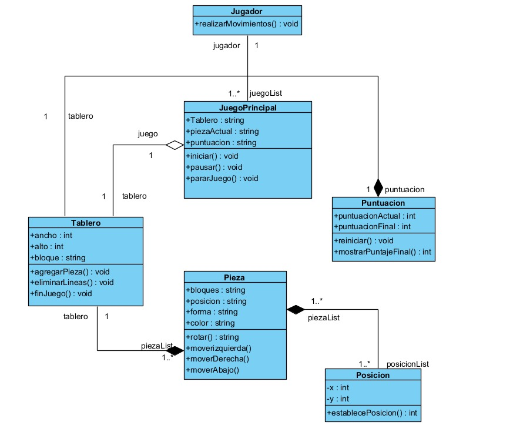

# JuegoPOO

Integrantes:

- Nathaly Nikooll Camacho Ordoñez. 
- Iván Alexander Fernandez Cañar. 
- José Francisco Riofrío Maldonado. 
- Ariana Sophía Sarango Tandazo.

Ciclo:

- Segundo "A"

# Diagrama UML

# Estructura del Proyecto

## Clases y Atributos

### JuegoPrincipal
- **Atributos:**
  - `+Tablero`
  - `+piezaActual`
  - `+siguientePieza`
  - `+puntuacion`
- **Métodos:**
  - `+iniciar() : boolean`
  - `+actualizar() : boolean`
  - `+finDeJuego() : boolean`
- **Descripción:**
  La clase principal que controla el flujo del juego. Maneja el tablero, las piezas actuales y siguientes, así como la puntuación del jugador.

### Tablero
- **Atributos:**
  - `+ancho`
  - `+alto`
  - `+bloque`
- **Métodos:**
  - `+agregarPieza() : boolean`
  - `+eliminarLineas() : boolean`
  - `+finJuego() : boolean`
- **Descripción:**
  Representa el tablero de juego donde las piezas caen. Controla las dimensiones y los bloques ocupados.

### Pieza
- **Atributos:**
  - `+bloques`
  - `+posicion`
  - `+forma`
- **Métodos:**
  - `+rotar()`
  - `+moverIzquierda()`
  - `+moverDerecha()`
  - `+moverAbajo()`
- **Descripción:**
  Modela las piezas que caen en el tablero. Puede rotar y moverse en distintas direcciones.

### Bloque
- **Atributos:**
  - `+color : string`
  - `+posicion`
- **Descripción:**
  Representa un bloque individual dentro de una pieza. Cada pieza está compuesta por varios bloques.

### Posicion
- **Atributos:**
  - `+x : int`
  - `+y : int`
- **Métodos:**
  - `+establecePosicion() : int`
- **Descripción:**
  Define la posición de un bloque o una pieza en el tablero usando coordenadas (x, y).

### Puntuacion
- **Atributos:**
  - `-puntuacionActual : int`
  - `-puntuacionFinal : int`
- **Métodos:**
  - `+reiniciar() : boolean`
  - `+mostrarPuntajeFinal() : int`
- **Descripción:**
  Maneja la puntuación del juego. Puede reiniciarse y mostrar la puntuación final.

## Relaciones

### JuegoPrincipal y Tablero
- Relación de agregación: `JuegoPrincipal` tiene un `Tablero`.

### Tablero y Pieza
- Relación de composición: `Tablero` contiene varias `Pieza`.

### Pieza y Bloque
- Relación de composición: `Pieza` está compuesta por varios `Bloque`.

### Pieza y Posicion
- Relación de asociación: `Pieza` tiene una `Posicion`.

### JuegoPrincipal y Puntuacion
- Relación de agregación: `JuegoPrincipal` maneja la `Puntuacion`.

